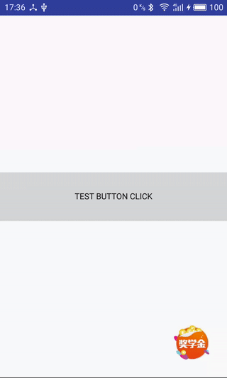

# FloatingBall
##效果图

##使用方法

	FloatBall floatBall = new FloatBall.Builder(this)
	                .setBottomMargin(90)//悬浮球初始位置BottomMargin
	                .setRightMargin(90)//悬浮球初始位置RightMargin
	                .setHeight(180)//悬浮球高度
	                .setWidth(180)//悬浮球宽度
	                .setRes(R.drawable.ic_ball)//图片资源
	                .setDuration(500)//靠边动画时间
	                .setBall(new ImageView(this))//默认悬浮球是View，如需设置特定View则设置此项，反则无需设置
	                .build();

	//悬浮球点击事件
	floatBall.setOnClickListener(new View.OnClickListener() {
            @Override
            public void onClick(View v) {
                Toast.makeText(MainActivity.this, "floating ball click", Toast.LENGTH_SHORT).show();
            }
        });

	//添加到你的父容器中
	flContent.addView(floatBall.getBall());
	

##导入方式

	dependencies {
	    compile 'com.zhengjt:floatingball:1.0.1'
	}

##License

	Copyright 2016 zhengjt

	Licensed under the Apache License, Version 2.0 (the "License");
	you may not use this file except in compliance with the License.
	You may obtain a copy of the License at

	   http://www.apache.org/licenses/LICENSE-2.0

	Unless required by applicable law or agreed to in writing, software
	distributed under the License is distributed on an "AS IS" BASIS,
	WITHOUT WARRANTIES OR CONDITIONS OF ANY KIND, either express or implied.
	See the License for the specific language governing permissions and
	limitations under the License.

